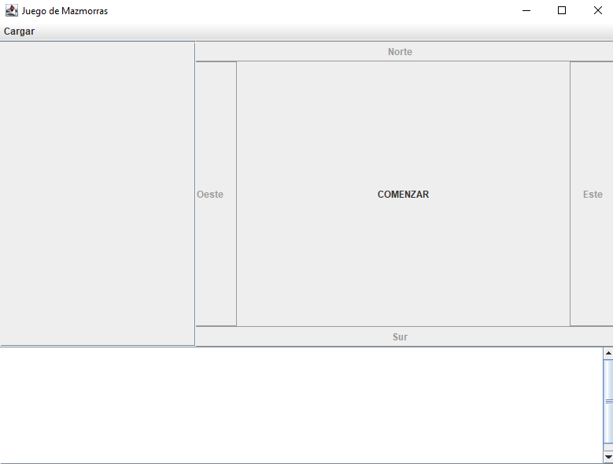
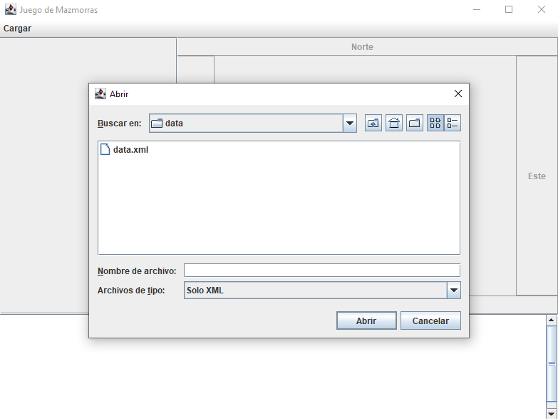
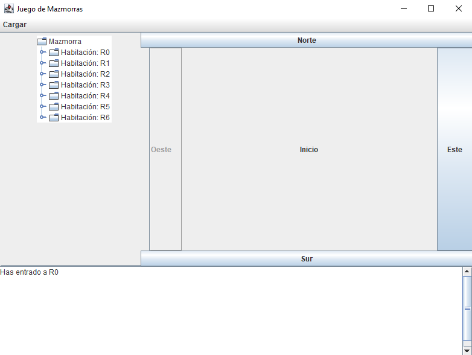
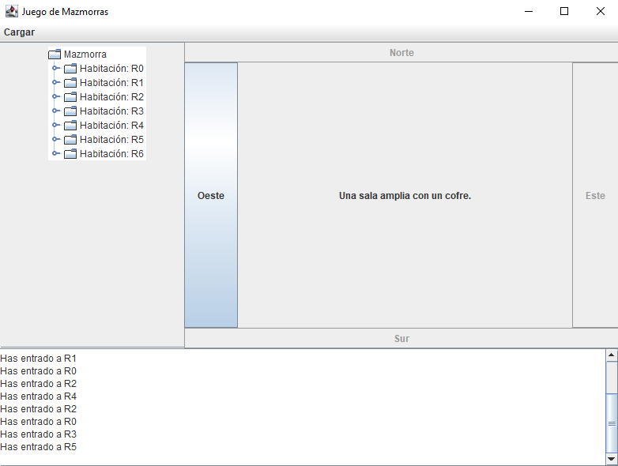

# 🏰 Mazmorra  

Proyecto básico en Swing.  

## 📜 Descripción  
Este es un proyecto realizado con **Swing** que permite moverse por una mazmorra con habitaciones conectadas por puertas.

## 🎮 Cómo jugar  
1. **Ejecutar el juego**
   - Presionar el boton de play o si no hay arranque configurado ir a la clase mazmorras/DungeonJuego y tendrás el botón de ejecutar ahí
   
   
3. **Cargar el archivo XML**:  
   - Tendrás un archivo de ejemplo en la carpeta `data`, puedes crear tu propio mapa siguiendo la misma estructura.  
   - Ve a la pestaña **Cargar** y pulsa en **Cargar Mapa**.
   

4. **Explorar la mazmorra**:  
   - Se generará un **JTree**, que representará las habitaciones de la mazmorra.  
   - El juego comenzará automáticamente.  

5. **Movimiento**:  
   - Usa los botones **Norte**, **Este**, **Sur** y **Oeste** para moverte.  
   - Solo estarán disponibles si hay una habitación conectada en esa dirección.  
   

6. **Interacción**:  
   - Cada vez que entres en una habitación, recibirás un mensaje con detalles sobre lo que hay en ella.  
   - El historial de movimientos se registrará en un campo de texto debajo del juego.  
   

¡Explora la mazmorra y descubre qué secretos oculta! 🏹🔦  
